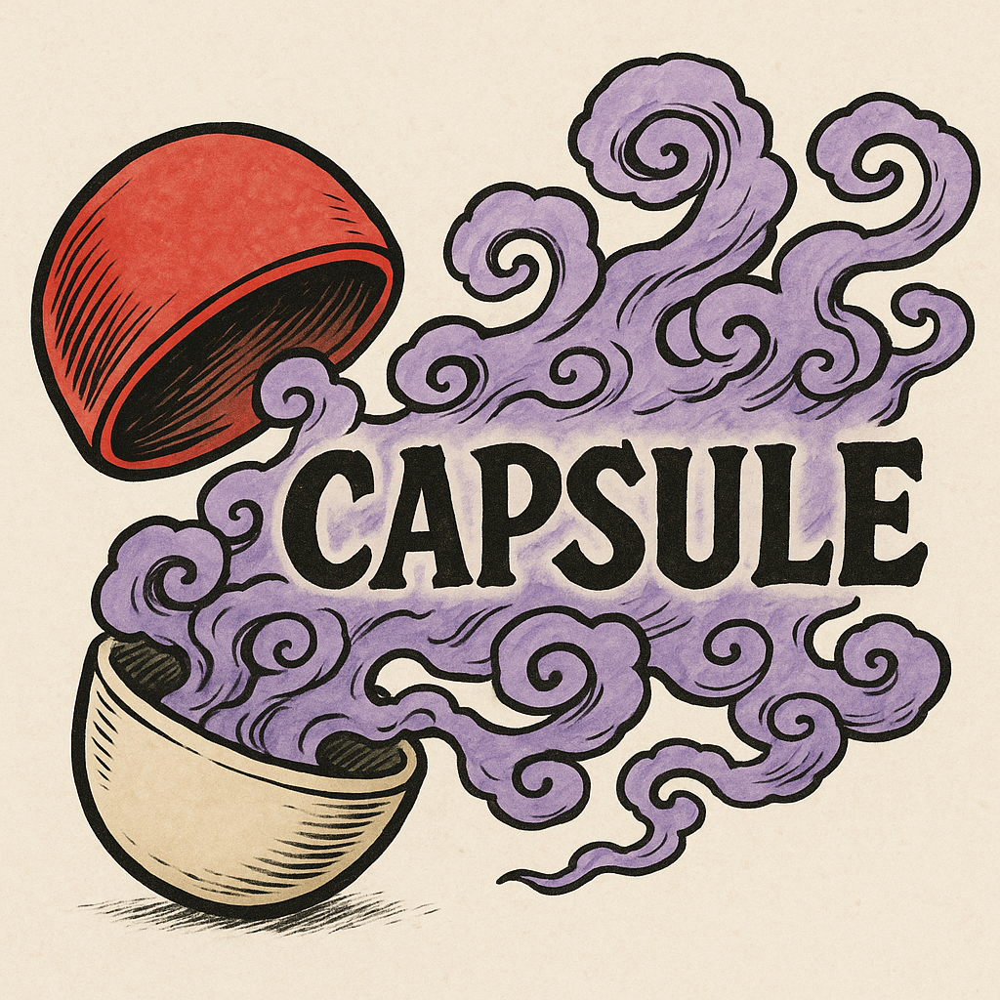

# Capsule



Capsule is an open‑core security runtime designed for teams embedding AI‑driven agents into production workflows. It compiles a human‑readable `capsule.yaml` policy into an OS‑native sandbox (Seccomp on Linux, Seatbelt on macOS), executes each agent tool invocation under that fine‑grained syscall filter, and writes a tamper‑evident Merkle–chained audit log of every action.

Most “typical” mitigations sit outside the agent—Kubernetes NetworkPolicy, Cloudflare Gateway, seccomp templates, ANSI scrubbers in web consoles, etc. Capsule fuses those layers into one declarative policy that (a) is stored, versioned, and hashed alongside code, (b) yields a Merkle-chained syscall log you can replay, and (c) reloads live without a container rebuild. For teams that already maintain strong infra controls, Capsule is complementary (adds syscall-level proof and simpler audit). For green-field agent startups it’s often strict-superset coverage with far less YAML sprawl. In short: yes—it’s competitive with most point solutions and uniquely unifies them.

## Who Is Capsule For?

- **AI Platform Engineers & DevOps** who need to safely integrate untrusted AI agents into CI/CD, cloud and on‑prem environments without proliferating bespoke container or VM configurations.
- **Security & Compliance Teams** that require cryptographic audit trails of every automated task an agent performs, with verifiable detection of tampering or unauthorized calls.
- **Dev Teams & Data Scientists** demanding low‑latency, local execution of AI assistants on sensitive codebases or customer data, without surrendering security controls to opaque container runtimes or high‑privilege daemons.

## Hair‑On‑Fire Problem

As organizations race to embed AI agents directly into their code, infrastructure and data‑processing pipelines, they face an explosion of fragmented sandboxing and logging solutions:

1. **Containers & VMs** ship broad syscall whitelists by default, leaving unknown kernel interfaces exposed and requiring cumbersome image maintenance.
2. **Custom seccomp rules** are often scattered across projects, lacking a unified policy language or automated audit logging.
3. **Opaque agent runtimes** obscure what code and syscalls an AI can invoke, undermining compliance and forensic investigations.

These gaps create critical attack vectors—arbitrary code execution, covert data exfiltration via unconventional syscalls, privilege escalation through forgotten interfaces, and undetectable post‑hoc tampering of audit records.

## Why Capsule Works

- **Human‑Readable Policy, Machine‑Enforced**: Define a concise YAML policy once (`capsule.yaml`). The Python SDK validates syntax and emits a JSON policy for the Rust CLI.
- **Syscall‑Level Isolation**: Seccomp‑BPF filters in the kernel enforce only the syscalls your agents need—no containers, no extra daemons, minimal overhead and no hidden gaps.
- **Cryptographic Audit Trail**: Every invocation and syscall event is appended to `capsule.log` as a Blake3–Merkle chain. Any insertion, deletion or modification is immediately detectable via `capsule verify`.
- **Unified Tooling**: The same `capsule run` CLI and `@capsule.tool` Python decorator handle policy enforcement, sandbox setup, execution, logging and verification—no scattered scripts.

_Compared to stitching together Dockerfiles, custom AppArmor profiles, and ad‑hoc loggers, Capsule offers a consolidated, end‑to‑end security architecture that’s easier to reason about, lighter to maintain, and stronger against kernel‑level exploits._

---

## Quick Start

### Building from Source

```bash
# Clone and build
git clone https://github.com/yourorg/capsule.git
cd capsule
cargo build --release
```

### Running a Command

```bash
# Enforce policy + sandbox + log to ./capsule.log
./target/release/capsule run echo "hello world"
```

### Verifying the Audit Log

```bash
# Verify integrity of capsule.log
./target/release/capsule verify
```

### Profiling Syscalls

```bash
# Generate syscall profiles for a list of commands
./target/release/capsule profile commands.txt --out-dir sysprofile/
```

---

## Docker

Build and run with Docker or Docker Compose:

```bash
# Build image
docker build -t capsule .

# Run a command inside the sandbox
docker run --rm -v $(pwd):/workspace capsule run ls -l
```

```yaml
# docker-compose.yml
version: '3'
services:
  capsule:
    build: .
    volumes:
      - ./:/workspace
    entrypoint: ['capsule', 'run']
    command: ['echo', 'Hello from Docker']
```

---

## Running Tests

```bash
# Unit & integration tests
eval "$(rustup which --toolchain stable)" && cargo test
```

---

For more details on policy syntax, sandbox customization and SDK integration, see the [docs/](docs/) directory or browse the source in `src/`.
