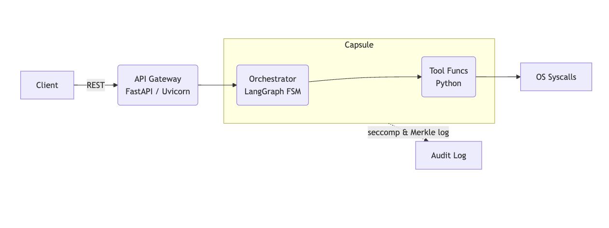

# Base Agent

The base agent is an agent server
is an "all in one agent server".
It's primary purpose is to serve as a base model
to build more interesting agent server setups.



This means that the Gateway API, Agent Graph, and Tools
are all defined and executed in the same container.

This is unlikely for prod deployed agents, as it is overly simple
and would fail at handling even small workloads. It is however easy
to develop Capsule against as all syscalls are on one host.

### Request flow looks like this:

```
1) Client → HTTP(S) POST /chat
2) Gateway (FastAPI) hands { message: … } to the Agent Graph.
3) Agent Graph calls the LLM (streaming).
4) If the LLM triggers “tool use,” the server will execute a Python function or spawn a subprocess.
5) All syscalls (e.g., socket(), connect(), execve(), open()) are visible to Capsule at the process level.
6) Output from the LLM (and any tool output) is streamed back to the HTTP client.
```

### Security

There is none.
The server would take any client request that connected.
The container has root access. It is a 100% free-for-all
for finding out what secuirty vulnerabiliteies you can get
an LLM based agent to facilitate when unrestricted.
